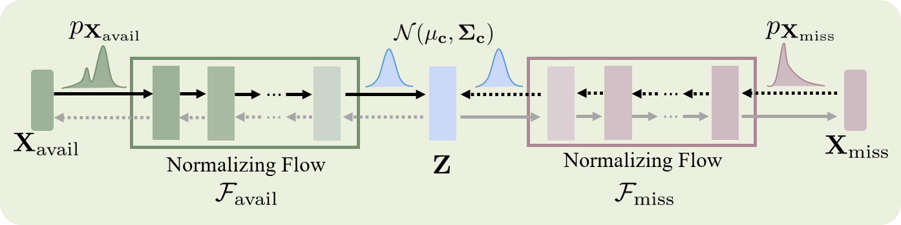
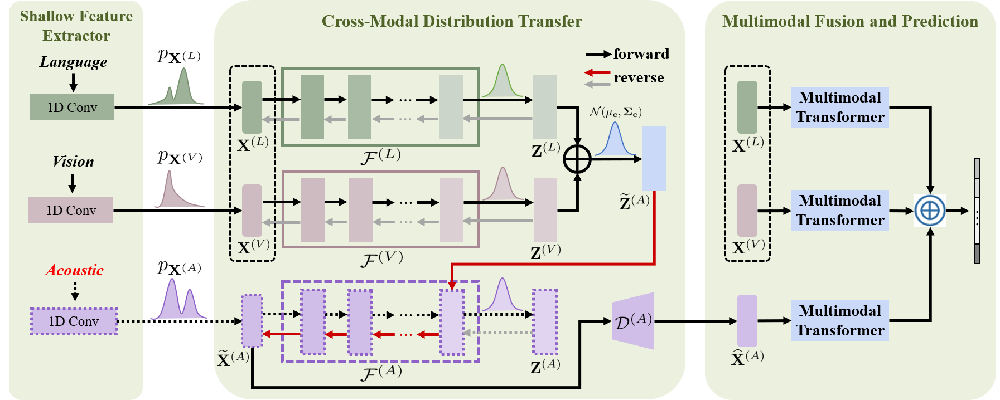

# [Distribution-Consistent Modal Recovering for Incomplete Multimodal Learning, ICCV 2023.](https://openaccess.thecvf.com/content/ICCV2023/html/Wang_Distribution-Consistent_Modal_Recovering_for_Incomplete_Multimodal_Learning_ICCV_2023_paper.html)


We propose a distribution-consistent modal recovering (DiCMoR) method to preserve the multimodal understanding performance under missing modality cases. The key contributions include:
- We propose a novel missing modality recovery framework by transferring the distributions from the available modalities to the missing modalities, which reduces the distribution gap between the recovered data and the vanilla available data.
- We propose a cross-modal distribution transformation method by designing class-specific multimodal flows, which not only ensures the congruence of the distributions but also enhances the discriminative capacity.

## The motivation.
Multimodal machine learning dedicates to designing a strong model for understanding, reasoning, and learning by fusing multimodal data, such as language, acoustic, and image. However, in real-world scenarios, the well-trained model may be deployed when certain modalities are not available, e.g., language may be unavailable due to speech recognition errors; acoustic modality may be lost due to background noise or sensor sensing limitations; visual data may be unavailable due to lighting, occlusion, or social privacy security. In practice, the problem of missing modality inevitably degrades the multimodal understanding performance.

## The main idea of DiCMoR.

Different from the previous paradigm, the main idea of DiCMoR is to transfer the distribution from available modalities to missing ones through the nice properties of normalizing flow (i.e., invertibility and exact density estimation), and generate more confident prediction with high distribution consistency.



Available modality $\mathbf{X}_{\text{avail}}$ is first projected into a latent state $\mathbf{Z}$ by the forward flow function of $\mathcal{F}\_{\text{avail}}$. Then, the latent state $\mathbf{Z}$ is injected into the reverse flow function of $\mathcal{F}\_{\text{miss}}$ and transferred to the missing modality $\mathbf{X}\_{\text{miss}}$ abided by its original distribution.

## The Framework.



The framework of DiCMoR. Please refer to our [paper](https://openaccess.thecvf.com/content/ICCV2023/html/Wang_Distribution-Consistent_Modal_Recovering_for_Incomplete_Multimodal_Learning_ICCV_2023_paper.html) for details.

## Usage

### Prerequisites
- Python 3.8
- PyTorch 1.9.0
- CUDA 11.4

### Datasets
Data files can be downloaded from [here](https://drive.google.com/drive/folders/1BBadVSptOe4h8TWchkhWZRLJw8YG_aEi), and you only need to download the aligned data. 
You can put the downloaded datasets into `dataset/` directory.

### Pretrained weights
Before running missing cases, you should [download](https://drive.google.com/drive/folders/1RatqmN6W7yagq195d8WWdN_TK0ctt2pI?usp=drive_link) the weights pretrained by complete multimodal data (i.e., MR=0.0).
You can put the downloaded weights into `pt/` directory.

### Run the Codes
Running the following command:
```
python train.py
```

### Citation
If you find the code helpful in your resarch or work, please cite the following paper.
```
@InProceedings{Wang_2023_ICCV,
    author    = {Wang, Yuanzhi and Cui, Zhen and Li, Yong},
    title     = {Distribution-Consistent Modal Recovering for Incomplete Multimodal Learning},
    booktitle = {Proceedings of the IEEE/CVF International Conference on Computer Vision (ICCV)},
    month     = {October},
    year      = {2023},
    pages     = {22025-22034}
}
```

